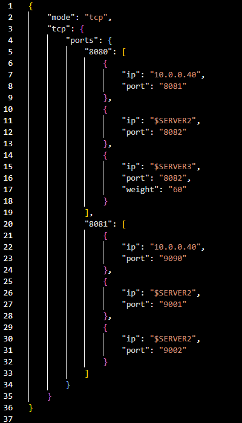
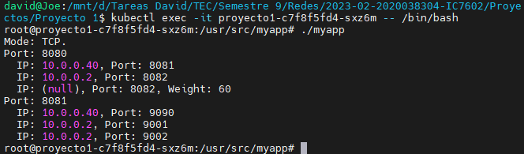
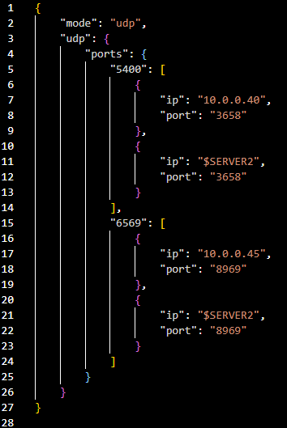
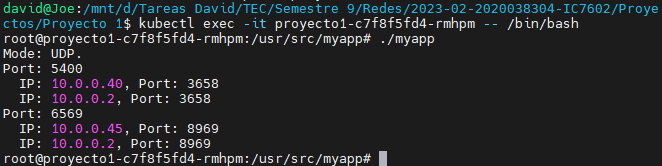
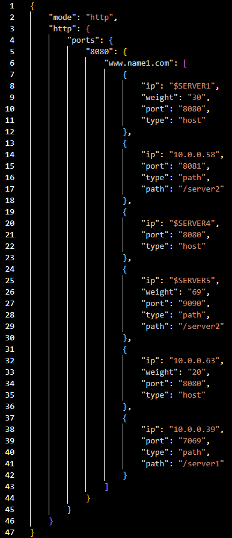
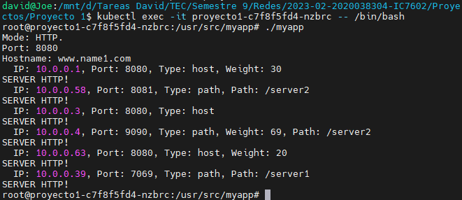
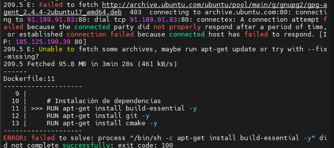

### **Redes (IC7602)** – Semestre 1, 2024
### **Proyecto 1**
### David Suárez Acosta – 2020038304
____

### Instrucciones de Ejecución

Para ejecutar el proyecto, se debe de tener instalado Helm Charts, Kubernetes y Docker Desktop. El siguiente paso es correr Kubernetes con Docker, para esto debemos ingresar a Docker Desktop, a las sección de *settings* y habilitar Kubernetes. Una vez que este funcionando, aparecerá el logo en verde en la esquina inferior izquierda.

Una vez que el Cluster de Kubernetes con Docker está corriendo, se debe ingresar desde una terminal a la carpeta del proyecto "Proyecto 1" y ejecutar el comando:

    helm upgrade --install proyecto1 proyecto1

Con esto, se debe crear un Deployment llamado *proyecto1* que corre la imagen de Docker y la app.c automáticamente.

### Pruebas Realizadas

Para comenzar, se realizaron pruebas del parser con los diferentes tipos de "config.json" que se nos envió de prueba. Para hacer estas pruebas, se tiene que tener el deployment y pod corriendo, como se explica en la sección anterior, y desde una terminal ubicada en la carpeta del proyecto ejectuar:

    kubectl exec -it proyecto1-c7f8f5fd4-lchsh -- /bin/bash

para ingresar al pod donde "proyecto1-c7f8f5fd4-lchsh" es el nombre del pod que se creó. A continuación, desde la carpeta "/usr/src/myapp" dentro del pod, se debe correr el comando:

    ./myapp

Dependiendo del "config.json" con el que se construye y se sube la imagen de docker, el resultado impreso en consola va a cambiar.

#### Prueba Parser TCP

La primera prueba se realizó corriendo el siguiente archivo "config.json" con el mode = TCP: 

Al correr la prueba, obtuve el siguiente resultado:

#### Prueba Parser UDP

La segunda prueba se realizó corriendo el siguiente archivo "config.json" con el mode = UDP: 

Al correr la prueba, obtuve el siguiente resultado:

#### Prueba Parser HTTP

La última prueba se realizó corriendo el siguiente archivo "config.json" con el mode = HTTP: 

Al correr la prueba, obtuve el siguiente resultado:

### Recomendaciones y Conclusiones

- Es buena idea asegurarse de que un programa corre sin errores antes de que se implemente en otras partes como por ejemplo Docker. Me paso que tuve un error por varios dias en el código de app.c donde la imagen de Docker y el Deployment que usaba la imagen se caían sin razón aparente y sin ningún log, algo que se hubiera evitado si me hubiera asegurado de que el código no tenía errores antes de subirlo a Docker.

- Personalmente, este trabajó me gustó bastante ya que tuve que programar y pensar lógicamente para poder crear el parser y todo lo que implica la lectura del JSON con C.

- A la hora de correr el comando *build* para construir la imagen de Docker, ocurrian errores al intentar instalar algunas librerias, un ejemplo de esto es el siguiente:

Estos errores pueden suceder cuando se importa cualquiera de las librerias y se dan por problemas de Internet, por lo que cuando suceden, solo tiene que volver a intentar ejecutar el "build" de la imagen de Docker.

- Es interesante ver el funcionamiento interno y completo que hay detrás de los proxy, gracias a este trabajo queda bastante claro el proceso.

- Las variables de entorno variables globales son muy útiles ya que permite costumizar los valores de configuración que van a estar en el config.json sin tener que estar cambiando el codigo fuente, en general es un método muy comodo para los diferentes aspectos de la programación.

- La mejor implementación que encontré para las variables de entorno fue por medio de values "env" en el Deployment. Intenté hacerlo de forma dinámica para que se pudiera leer un archivo ".env" desde el Dockerfile que tuviera las variables de entorno y que estas se guardaran directamente en la imagen pero al final no resultó y me costó mucho tiempo.

- En caso de que Docker de problemas para correr Kubernetes, se puede intentar reiniciar el cluster desde la sección de Kubernetes en los *settings* de Docker Desktop. Si aun despues de haberlo intentado varias veces sigue sin correr, se pueden cerrar todos los servicios de Docker con Task Manager, de esta forma logré que funcionara el cluster siempre.