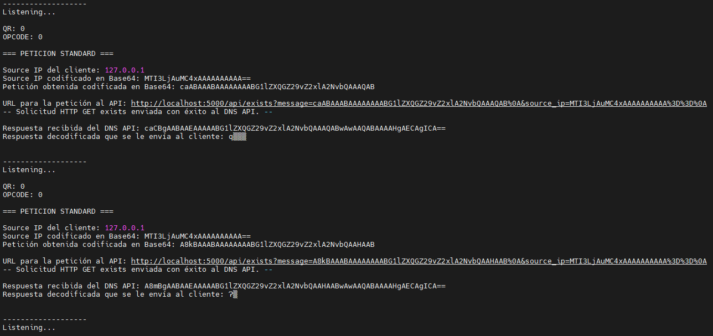
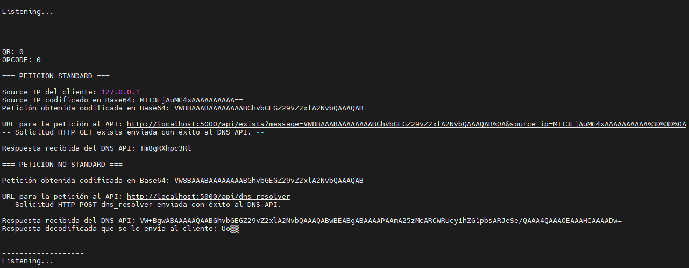

### **Redes (IC7602)** – Semestre 1, 2024
### **Proyecto 2**
### David Suárez Acosta – 2020038304
____

### Componentes implementados

Para este proyecto 2 de Redes, se completaron e implementaron los componentes:

- **DNS Interceptor**: es un programa en C que recibe la petición inicial del cliente usando sockets y debe leer e interpretarla basandose en *RFC2929 y RFC1035*. Además es el componente que le envía la respuesta al cliente una vez que se obtiene y le envía peticiones HTTP al componente *DNS API*.
- **DNS API**: es un programa en Python que recibe peticiones HTTP y debe enviar solicitudes a un servidor *DNS Remoto* así como conectarse y hacerle peticiones a las bases de datos de *Firebase*.

### Como ejecutar el proyecto

#### Correr localmente

Para ejecutar el proyecto de forma local, se deben de tener todas las librerias necesarias instaladas y se deben de tener 3 terminales corriendo simultaneamente. 

**DNS Interceptor**

En la terminal, se tiene que correr desde la carpeta "Proyectos/Proyecto 2/docker/dnsinterceptor/app/" y se debe ejecutar

    gcc app.c -o app -lb64 -lcurl

para compilar la aplicación y se debe ejecutar

    sudo ./app

para correr la aplicación.

**DNS API**

En la terminal, se tiene que correr desde la carpeta "Proyectos/Proyecto 2/docker/dnsapi/app/" y se debe ejecutar

    python3 dns_api.py

para correr la aplicación.

**Cliente**

En la terminal, se puede correr desde cualquier directorio y se debe ejecutar

    nslookup

para abrir *nslookup* en modo interactivo. Antes de comenzar, se debe ejecutar

    set timeout=1000

para que no existan problemas con timeouts. A continuación, se ejecuta

    server 127.0.0.1

para correrlo localmente. Finalmente se corre el host que se desea probar en el sistema, las opciones son

*Single*

    www.google.com

*Multi*

    mail.google.com

*Weight*

    meet.google.com

*Geo*

    workspace.google.com

#### Correr con Helm Charts

Para correrlo de forma automatizada con Helm Charts, simplemente se deben ejecutar los siguientes comandos desde la carpeta "Proyectos/Proyecto 2"

    helm upgrade --install dnsinterceptor dnsinterceptor

para instalar el Helm del componente DNS Interceptor y el comando

    helm upgrade --install dnsapi dnsapi

para instalar el Helm del componente DNS API.

### Pruebas realizadas

Se realizaron pruebas locales usando el comando *nslookup* para probar como los componentes interactuan entre si y manejan los diferentes hosts y tipos de registros en la base de datos.

#### Single

Se hace la petición "www.google.com" para obtener el resultado del registro de tipo *single*. El resultado es el IP guardado en Firebase (8.8.8.8).

**Client**

**DNS Interceptor**

**DNS API**

**Firebase**

#### Multi

Se hace la petición "meet.google.com" para obtener el resultado del registro de tipo *multi*. El resultado es el IP escogido por el mecanismo de *round-robin* (8.8.8.8 y 9.9.9.9).

**Client**

**DNS Interceptor**

**DNS API**

**Firebase**

#### Weight

Se hace la petición "mail.google.com" para obtener el resultado del registro de tipo *weight*. El resultado es el IP escogido basado en el peso de todos los registros, con mayor peso indicando mayor probabilidad de ser escogido (8.8.8.8 y 8.8.8.8).

**Client**

**DNS Interceptor**

**DNS API**

**Firebase**

#### Geo

Se hace la petición "workspace.google.com" para obtener el resultado del registro de tipo *geo*. El resultado es el IP del registro con el mismo país que el Source IP del cliente, en este caso como se está corriendo localmente, el Source IP es "127.0.0.1", por lo que el Firebase de los paises lo considera como el país "ZZ", es decir que no es un IP válido (1.0.0.0).

**Client**

**DNS Interceptor**

**DNS API**

**Firebase**

#### No Encontrado

Se hace la petición "hola.google.com" para obtener el resultado de que no se encuentre un registro en Firebase. El resultado, que es el equivalente a que se reciba una petición *Query No Standard*, es lo que devuelve una petición al servidor DNS Remoto de Google (8.8.8.8).

**Client**

**DNS Interceptor**

**DNS API**

### Recomendaciones y conclusiones

1. Cuando se trabaja con sockets es buena idea realizar pruebas de conexión constantemente ya que pueden haber mucho errores de conexión y es importante saber que IPs y puertos se van a usar para que no hayan choques.

2. Descubrí que la mejor forma de crear una respuesta DNS de forma manual es modificar la petición original en lugar de crearla desde cero, ya que de esta forma se mantienen los datos principales como el ID y el HOST.

3. Es importante siempre conocer el ID de la petición DNS original, si se usa otro ID causa el error "expected id N, got X".

4. Firebase resultó ser una base de datos muy comoda y facil de usar, crear los registros y hacer la conexión con Firebase fue un proceso relativamente rápido.

5. El proceso de subir la base de datos de "IP to Country" a Firebase fue complejo ya que tuve que crear un programa en Python para descomprimir el archivo, pasarlo a JSON y quitarle caracteres especiales que no eran admitidos por Firebase.

6. Enviar una petición a un DNS remoto fue interesante ya que se hace por medio de sockets y se espera que este le devuelva un resultado. Para esta parte del componente DNS API se podría haber usado otro servidor remoto en lugar de Google (8.8.8.8), como por ejemplo (7.7.7.7) y (9.9.9.9).

7. A la hora de recibir las peticiones HTTP en el DNS API, con las peticiones POST no hubo problema ya que el mensaje se podía enviar en el *body* de la petición, pero con las peticiones GET tuve que ser creativo para poder enviar tanto la petición que se estaba haciendo (para poder construir la respuesta más adelante) y el Source IP del cliente para las peticiones de tipo Geo.

8. Es importante usar el comando "set timeout=1000" en el nslookup en el modo interactivo, con esto evita que existan problemas a la hora de enviar una petición de tipo Geo ya que estas duran alrededor de un minuto.

9. No logré realizar pruebas directas de una petición *No Standard* desde nslookup, por lo que las dos formas de probar esta sección son por medio de peticiones no registradas en el Firebase, como "hola.google.com", o cambiando el código para que se corra esto en lugar de *Standard*.

10. Me pareció interesante que las codificaciones en Base64 de la aplicación de C y la aplicación de Python resultaran en un mensaje diferente, pero a la hora de hacer decodificarlos se recibía el mismo mensaje, no logré entender por qué esto se daba.